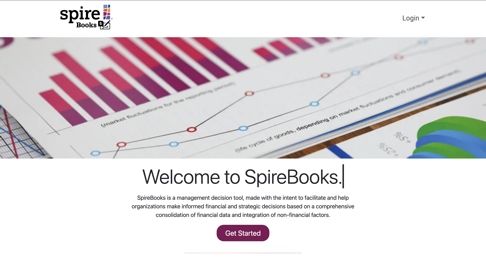
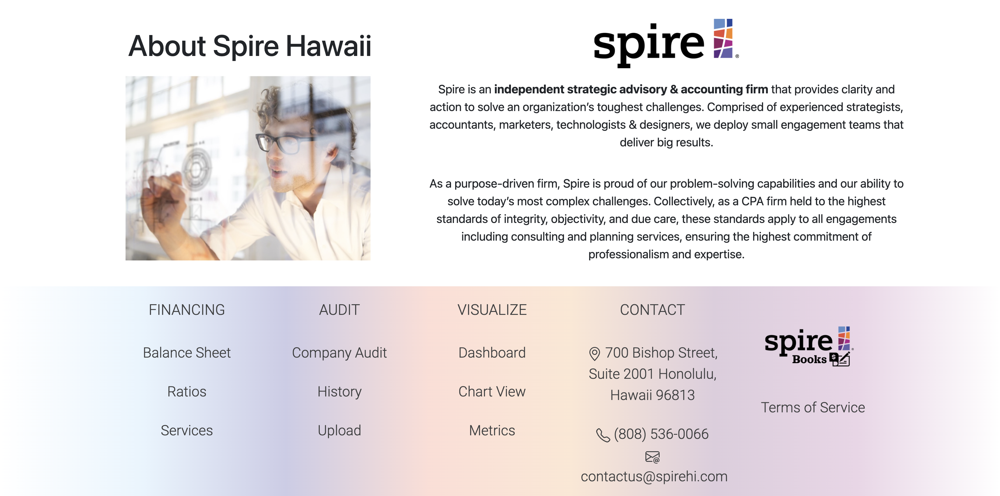
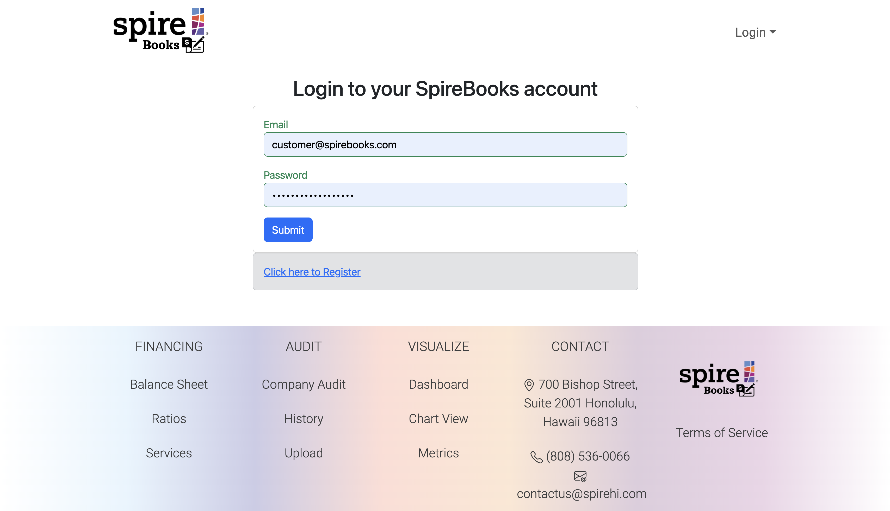
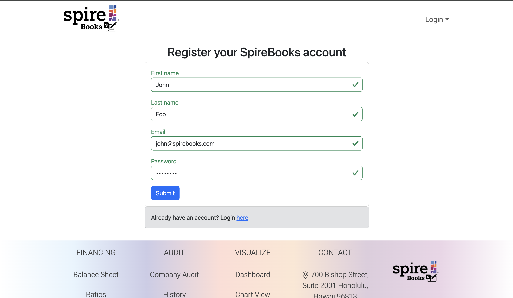
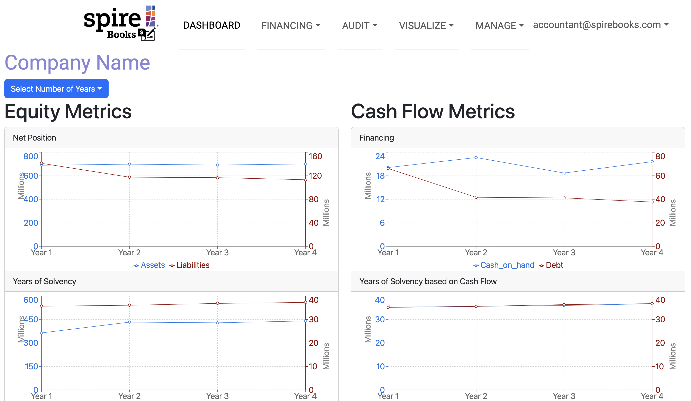
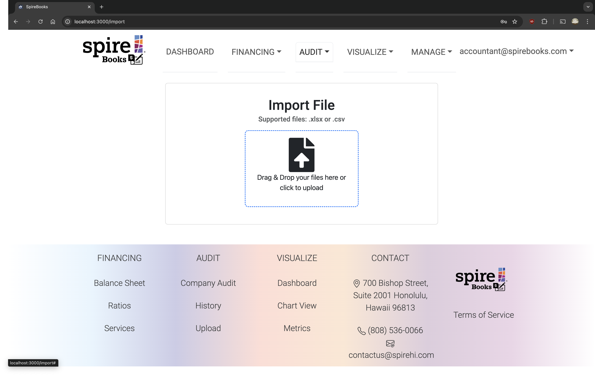

# Team Half and Half

## Table of Contents
- [Overview](#overview)
- [Key Outcomes](#key-outcomes)
- [User Guide](#)
- Community Feedback
- Developer Guide
- Continuous Integration
- Deployment
- Development History
- Team Members

## Overview
[SpireBooks](https://github.com/Team-Half-and-Half/spirebooks) is a management decision tool, made with the intent to facilitate and help organizations make informed financial and strategic decisions based on a comprehensive consolidation of financial data and integration of non-financial factors.

GitHub organization page: [github.com/Team-Half-and-Half](https://github.com/Team-Half-and-Half)

## Key Outcomes

* Succeed in building a decision-making management tool that can be easily used by autonomous companies 
* Visualize an interactive fiscal sustainability model spreadsheet
* Make it easy for companies to understand their current financial state based on the historical data
* Utilize features for companies to input their own data which will then allow the web application to do the math and show a visual representation of the forecast
* Visually present the companies numbers as non-static, allowing them to see how different inputs can change the forecast
* Create visually pleasing charts and dashboard that are easy to look at and navigate

## User Guide

Landing

Sign In

Sign Up

Dashboard

Import Data

## Community Feedback
## Developer Guide
## Continuous Integration

SpireBooks uses [GitHub Actions](https://docs.github.com/en/free-pro-team@latest/actions) to automatically run ESLint and TestCafe each time a commit is made to the default branch.  You can see the results of all recent "workflows" at [https://github.com/Team-Half-and-Half/spirebooks/actions](https://github.com/Team-Half-and-Half/spirebooks/actions).

## Deployment
## Development History
The development process for SpireBooks conformed to Issue Driven Project Management practices. In a nutshell:

- Development consists of a sequence of Milestones.
- Each Milestone is specified as a set of tasks.
- Each task is described using a GitHub Issue, and is assigned to a single developer to complete.
- Tasks should typically consist of work that can be completed in 2-4 days.
- The work for each task is accomplished with a git branch named "issue-XX", where XX is replaced by the issue number.
- When a task is complete, its corresponding issue is closed and its corresponding git branch is merged into master.
- The state (todo, in progress, complete) of each task for a milestone is managed using a GitHub Project Board.
- The following sections document the development history of SpireBooks.

### Milestone 1
The goals for Milestone 1 are to have several mockup pages and acceptance tests.

Milestone 1 was managed using [SpireBooks Github Project Board M1](https://github.com/orgs/Team-Half-and-Half/projects/1/views/1).

### Milestone 2
The goals for Milestone 2 are to add functionality to the pages and to setup our databases.

Milestone 2 was managed using [SpireBooks Github Project Board M2](https://github.com/orgs/Team-Half-and-Half/projects/5/views/2).

## Team Members
SpireBooks was created for and in collaboration with Spire Hawaii as part of the University of Hawaii at Manoa's Software Engineering II Fall 2024 course. It is created and maintained by the following students:

* [Xavier Burt](https://xavierburt.github.io/)
* [Jonathan Sapolu](https://jsapolu99.github.io/)
* [Nicholas Beydler](https://beydlern.github.io/)
* [Christopher Pascual](https://caspascual.github.io/)
* [Samantha Mallari](https://samallari.github.io/)
* [Anthony Tirabassi](https://t-tirabassi.github.io/)
* [Payton Higa](https://PaytonHAH.github.io/)
* [Brandon Nelson](https://bksnelson.github.io/)

View our team contract [here](https://docs.google.com/document/d/1PjFIRw1aXRPUn2tKEE4p0D7bu_I8XHgkIsCQO42zJVk/edit?usp=sharing).